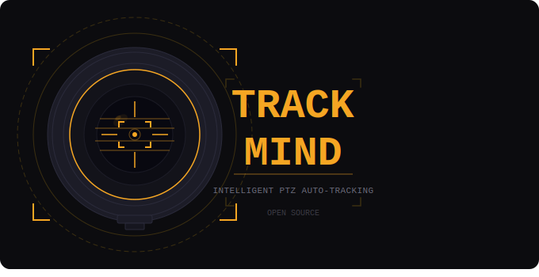

<p align="center">
  
</p>

# TrackMind
### Intelligent PTZ Auto-Tracking


---

AI-built desktop application that brings intelligent auto-tracking to PTZOptics cameras. Uses MediaPipe pose detection to locate a person in the camera's RTSP video feed and sends real-time VISCA over IP pan, tilt, and zoom commands to keep them centered in frame.

Built as an open-source replacement for the PTZOptics CMP tracking feature, which dropped support for G2 USB-model cameras.

---

## Requirements

- Windows 10 or 11
- PTZOptics camera with a LAN port (tested on PT12X-USB-G2)
- Camera LAN port connected to the same network as your PC
- Python 3.10 or newer — https://www.python.org/downloads/
  - Check **Add Python to PATH** during install (only needed for source install)

---

## Installation

### Recommended — Windows Installer

Run `Trackmind_Setup.exe` and follow the prompts. Creates a Start Menu entry, desktop shortcut, and uninstaller. No Python required.

### Run from Source

1. Install Python 3.10+ — check **Add Python to PATH**
2. Double-click `INSTALL.bat` to install dependencies
3. Double-click `START_TRACKER.bat` to launch

### Build Your Own Installer

1. Run `INSTALL.bat`
2. Run `BUILD_EXE.bat` — produces `dist\PTZ_AutoTracker.exe`
3. Install NSIS from https://nsis.sourceforge.io/Download
4. Run `BUILD_INSTALLER.bat` — produces `Trackmind_Setup.exe`

---

## Camera Setup

1. Connect your camera LAN port to your network
2. Find the camera IP — check your router, or try `http://192.168.100.88` (factory default)
3. PC and camera must be on the same subnet
4. VISCA over IP must be enabled — camera web UI → Network settings
5. VISCA uses TCP port 5678 — make sure Windows Firewall is not blocking it

**RTSP stream URLs:**
```
Main stream (1080p): rtsp://admin:admin@[camera-ip]/1
Sub stream  (720p):  rtsp://admin:admin@[camera-ip]/2  ← recommended
```

---

## Using the App

The app connects to the camera automatically on startup. The preview shows **NO SIGNAL** until the stream connects (2–5 seconds).

### Tracking Button
Starts and stops auto-tracking. When ON (green) the camera follows whoever is detected in frame. When OFF the camera stops moving and you have full manual control via joystick, Stream Deck, vMix, or any other controller.

### Lock Button
While tracking is ON, click **LOCK** to lock onto the current subject. The camera ignores everyone else. Click again to unlock — tracking continues but freely switches to whoever is most prominent. Lock resets automatically when tracking is turned off.

### Settings Panel

**Camera**

| Field | Description |
|-------|-------------|
| Camera IP | LAN IP of your PTZOptics camera |
| Username | RTSP username (default: `admin`) |
| Password | RTSP password (default: `admin`) |
| Stream 1/2 | `1` = main 1080p, `2` = sub 720p — use `2` for lower latency |
| Home Preset | Preset recalled when subject is lost for 3+ seconds |

**Pan / Tilt**

| Field | Description |
|-------|-------------|
| Pan Slow / Fast | Pan speed when slightly / far off-center (1–24) |
| Tilt Slow / Fast | Tilt speed when slightly / far off-center (1–24) |
| Vertical Offset | Fine-tune aim point. -5 = higher, +5 = lower, 0 = centered |

**Zoom**

| Field | Description |
|-------|-------------|
| Enable Auto-Zoom | Toggle auto-zoom on/off. Off = manual zoom only |
| Target Fill % | How much frame height the person occupies. 45 = zoomed out, 80 = tight |
| Dead Zone % | Tolerance before zoom activates. Higher = less hunting. Recommended: 20 |
| Zoom Speed | Motor speed 0–7. Start at 1 for smooth motion |

**Apply Settings** — applies all values to the live tracker immediately. No restart needed.

**Quick Presets 1–9** — one-click preset recall buttons.

### Advanced Settings

Click **⚙ Advanced Settings** to expand:

| Field | Default | Description |
|-------|---------|-------------|
| Pan Dead Zone | 0.10 | Fraction of frame where small pan offsets are ignored. Higher = less twitching near center |
| Tilt Dead Zone | 0.10 | Same for tilt |
| Latency Comp | 0.40 | Seconds of look-ahead to compensate for RTSP delay. Too high = oscillation |
| Lost Timeout | 3.0 | Seconds before camera returns to home preset when subject is missing |

### Keyboard Shortcuts

| Key | Action |
|-----|--------|
| F11 | Toggle fullscreen |
| Esc | Exit fullscreen |

---

## Stream Deck / vMix Integration

TrackMind listens on **UDP port 9876** for external preset signals. Send a UDP packet containing `PRESET:5` (or any number) to trigger a preset from an external source.

**Stream Deck example** (System: Run action):
```
python -c "import socket; s=socket.socket(socket.AF_INET,socket.SOCK_DGRAM); s.sendto(b'PRESET:5',('127.0.0.1',9876))"
```

---

## How It Works

1. Video is pulled from the camera's RTSP stream over the LAN port
2. Each frame is processed by **MediaPipe Pose** — a local AI model, no internet required
3. A dedicated buffer thread drains the RTSP stream continuously, keeping only the latest frame to prevent lag buildup
4. Velocity prediction estimates where the subject is heading to compensate for RTSP latency
5. **VISCA over IP** pan/tilt/zoom commands are sent to the camera's LAN port (TCP 5678)

**Lock-on:** When LOCK is active, the detector only follows detections within 25% of the frame distance from the last known position of the locked subject. Anyone else is ignored.

---

## Troubleshooting

**App opens but shows NO SIGNAL**
- Check camera IP is correct in the Camera section
- Test in VLC: Media → Open Network Stream → `rtsp://admin:admin@[ip]/2`
- Verify username and password are correct

**Camera doesn't move**
- Ping the camera IP from your PC
- Check TCP port 5678 is not blocked by Windows Firewall
- Confirm VISCA over IP is enabled in the camera web UI

**Tracking is jittery or oscillating**
- Increase Pan/Tilt Dead Zone in Advanced Settings (try 0.15)
- Lower Pan Slow speed
- Reduce Latency Comp (try 0.2)

**Camera goes in the wrong direction**
- In `autotrack.py` find `pan_vel = -zone_speed(...)` and remove or add the minus sign

**EXE shows default Windows icon**
- Make sure `trackmind_icon.ico` is in the same folder as `autotrack.py` before building
- Rebuild with `BUILD_EXE.bat`

---

## File Reference

| File | Description |
|------|-------------|
| `autotrack.py` | Main application |
| `START_TRACKER.bat` | Launch the app |
| `INSTALL.bat` | Install Python dependencies |
| `BUILD_EXE.bat` | Compile to standalone exe using PyInstaller |
| `BUILD_INSTALLER.bat` | Wrap exe into Windows installer using NSIS |
| `installer.nsi` | NSIS installer script |
| `make_bmp.py` | Generates the installer welcome screen graphic |
| `requirements.txt` | Python package list |
| `list_devices.py` | Lists available video capture devices |
| `debug_test.py` | Step-by-step diagnostic if app fails to start |
| `DEBUG.bat` | Runs app with full error output visible |
| `trackmind_logo.svg` | Full horizontal logo |
| `trackmind_icon.svg` | Square icon with transparent background |
| `trackmind_icon.ico` | Windows icon file |
| `trackmind_installer.bmp` | NSIS installer welcome image (164×314) |
| `context.txt` | Full technical documentation |

---

## Dependencies

| Package | Version | Notes |
|---------|---------|-------|
| opencv-python | >= 4.8.0 | Video capture and frame processing |
| mediapipe | == 0.10.9 | Pinned — newer versions removed the solutions API |
| Pillow | >= 10.0.0 | UI image rendering |
| numpy | >= 1.24.0 | Array operations |

---

## Known Limitations

- RTSP latency (1–3s) means the camera lags the subject slightly. Velocity prediction compensates but does not fully eliminate this. A direct USB connection to the camera would give zero latency.
- MediaPipe single-pose model always detects the most visually prominent person in frame.

---

## Built With

- [MediaPipe](https://mediapipe.dev) — pose detection
- [OpenCV](https://opencv.org) — video capture
- [Tkinter](https://docs.python.org/3/library/tkinter.html) — UI
- [PyInstaller](https://pyinstaller.org) — exe packaging
- [NSIS](https://nsis.sourceforge.io) — Windows installer
