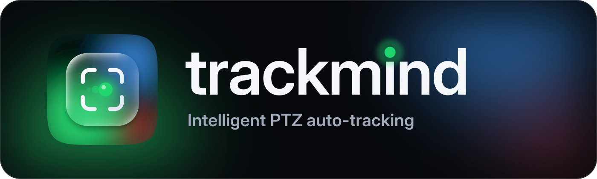
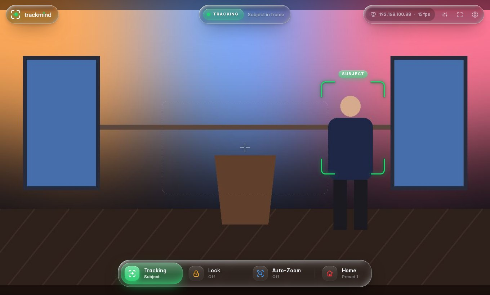
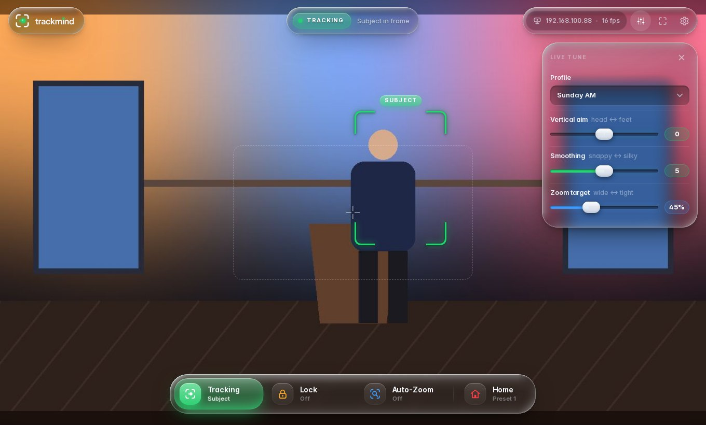
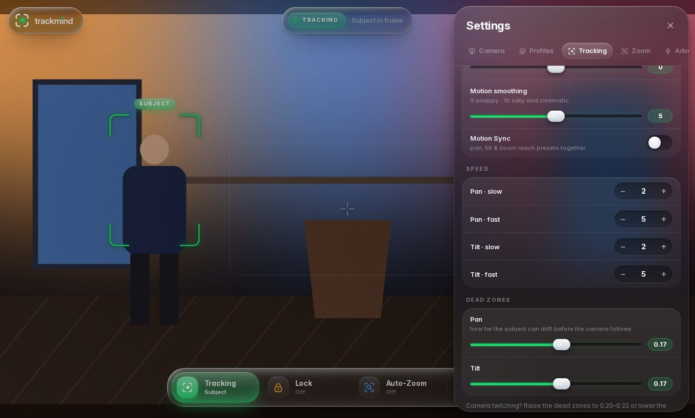
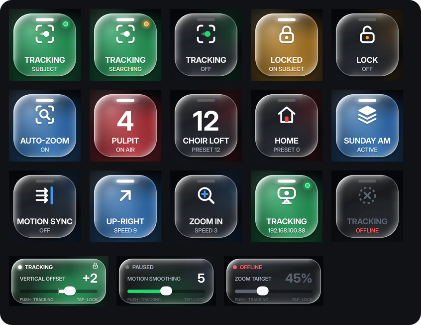

<p align="center">
  
</p>

<p align="center">
  
  
  
  
  
</p>

---

Trackmind is an AI-built desktop app that brings intelligent auto-tracking to PTZOptics cameras. It uses MediaPipe pose detection to find a person in the camera's RTSP video feed. It then sends real-time VISCA-over-IP pan, tilt, and zoom commands to keep them centered in frame.

It started as an open-source replacement for the PTZOptics CMP tracking feature, which dropped support for G2 USB-model cameras. It now has a liquid-glass interface built around the live picture, and a Stream Deck plugin with vMix-style tally keys.

<p align="center">
  
</p>

---

## Requirements

- Windows 10 or 11 (the app window uses Microsoft Edge WebView2, which is built into Windows 11 and up-to-date Windows 10)
- PTZOptics camera with a LAN port (tested on PT12X-USB-G2)
- Camera LAN port connected to the same network as your PC
- To run from source: Python 3.9–3.11 — https://www.python.org/downloads/
  - Check **Add Python to PATH** during install
  - mediapipe 0.10.9 does not support Python 3.12+

---

## Installation

### Recommended — Windows installer

Run `Trackmind_Setup_vX.Y.exe` from the [latest release](https://github.com/coder747-8i/Trackmind/releases/latest) and follow the prompts. It creates a Start Menu entry, a desktop shortcut, and an uninstaller. No Python required.

### Run from source

1. Install Python 3.9–3.11 and check **Add Python to PATH**.
2. Double-click `INSTALL.bat` to install dependencies.
3. Double-click `START_TRACKER.bat` to launch.

To open the interface in your web browser instead of an app window, run `python autotrack.py --browser`. It's the same UI, served locally.

### Build your own EXE

1. Install Python 3.9–3.11.
2. Double-click `BUILD_EXE.bat`. It installs all dependencies and produces `dist\Trackmind.exe`.
3. *(Optional)* Install NSIS from https://nsis.sourceforge.io/Download, then run `BUILD_INSTALLER.bat` to produce `Trackmind_Setup_vX.Y.exe`.

---

## First launch

Trackmind opens with a short setup wizard:

1. **Camera IP.** The LAN IP of your camera. The factory default is `192.168.100.88`.
2. **Login.** RTSP username and password (usually `admin` / `admin`).
3. **Home preset.** Where the camera returns when the subject is lost. Use `0` if you haven't saved presets yet.
4. **Sensitivity.** How far the subject can drift before the camera follows. `0.17` is a great start.

Settings are stored per Windows user in `%USERPROFILE%\.trackmind\<username>\config.json`, so each person on a shared PC has their own settings.

---

## Camera setup

1. Connect the camera's LAN port to your network.
2. Find the camera's IP in your router, or try `http://192.168.100.88` (the factory default).
3. The PC and the camera must be on the same subnet.
4. Enable VISCA over IP in the camera's web UI (Network settings).
5. VISCA uses TCP port 5678. Make sure Windows Firewall isn't blocking it.

**RTSP stream URLs:**
```
Main stream (1080p): rtsp://admin:admin@[camera-ip]/1
Sub stream  (720p):  rtsp://admin:admin@[camera-ip]/2  ← recommended (default)
```

---

## Using the app

The live camera fills the window. Every control floats over the picture as liquid glass, which refracts the video behind it, so the shot always stays the hero.

| Where | What |
|---|---|
| **Top left** | Trackmind logo |
| **Top center** | Tally pill: **TRACKING** (green), **LOCKED** (amber), **PAUSED**, **CONNECTING** (amber), **NO SIGNAL** (red). Next to it is what the tracker is doing right now. |
| **Top right** | Camera chip (IP and live FPS; click it for camera settings), **Live tune**, **Full screen**, **Settings** |
| **Bottom dock** | The buttons you use during a service: **Tracking**, **Lock**, **Auto-Zoom**, **Home** |
| **On the video** | A green reticle follows the subject (it turns amber when locked). The dashed box is the dead zone, where the camera stays still. |

- **Tracking (T):** when on, the camera follows whoever is detected in frame. When off, the camera stops, and you have full manual control from a joystick, Stream Deck, vMix, or any other controller.
- **Lock (L):** while tracking, locks onto the current subject and ignores everyone else. Turning tracking off releases the lock.
- **Auto-Zoom (Z):** zooms in and out to keep the subject filling the frame.
- **Home (H):** recalls the home preset and pauses tracking so the shot holds.

### Live tune

Click the sliders icon or press **U** for a floating panel that adjusts tracking while you're live: switch **profile**, set the **vertical aim** (head ↔ feet), **smoothing** (snappy ↔ silky), and the **zoom target**. Changes apply instantly and are saved.

<p align="center">
  
</p>

### Keyboard shortcuts

| Key | Action |
|---|---|
| `T` | Tracking on / off |
| `L` | Lock on / off |
| `Z` | Auto-zoom on / off |
| `H` | Recall home preset |
| `U` | Live tune panel |
| `F` / `F11` | Full screen |
| `,` | Settings |
| `Esc` | Close panel / leave full screen |

---

## Settings

Click the gear (or press `,`). Every change applies immediately and is saved. There's no Apply button. Camera fields apply when you press Enter or leave the field, then the stream reconnects.

<p align="center">
  
</p>

### Camera

| Setting | Default | Description |
|---|---|---|
| IP address | — | LAN IP of the camera |
| Username / Password | admin / admin | RTSP login |
| Stream | Sub · 720p | Main (1080p) or Sub (720p). Sub has lower latency. |
| Home preset | 0 | Recalled when the subject is lost, and by the **Home** button |

### Profiles

Save the current settings under a name, then load or delete profiles later. This is useful for different rooms, presenters, or camera positions. The active profile is marked.

### Tracking

| Setting | Default | Description |
|---|---|---|
| Vertical aim | 2 | −7 = top of head, 0 = centered, +7 = feet |
| Motion smoothing | 5 | How gently the camera eases into and out of moves. 0 = instant, 10 = silkiest (slightly slower to react). |
| Motion Sync | Off | PTZOptics Motion Sync: pan, tilt and zoom reach a recalled preset at the same moment. It's pushed to the camera on connect and saved per profile. |
| Pan / Tilt · slow, fast | 2 / 5 | Speed range (1–24). Speed glides smoothly between slow (just off center) and fast (at the frame edge). |
| Dead zones · pan, tilt | 0.17 | Fraction of the frame the subject can drift before the camera follows. Higher is steadier. |

### Auto-zoom

| Setting | Default | Description |
|---|---|---|
| Auto-zoom | Off | Keep the subject filling the frame |
| Target fill | 45% | How much of the frame height the subject fills. 45 = wider, 80 = tight. |
| Tolerance | 20% | How far off target before zoom kicks in. Higher = less hunting. |
| Zoom speed | 1 | Motor speed 0–7. Start at 1 for smooth motion. |

### Advanced

| Setting | Default | Description |
|---|---|---|
| Latency compensation | 0.40 s | Look-ahead that offsets RTSP delay. Too high causes oscillation. |
| Lost timeout | 2.0 s | Seconds before returning to the home preset when the subject is missing |
| Glass | Liquid | **Lite** skips the refraction effect on slower PCs |
| Tracking overlay | On | Show or hide the reticle and dead-zone guide |

### Stream Deck

| Setting | Default | Description |
|---|---|---|
| Control API | On | Local-only HTTP API used by the Stream Deck plugin, Companion, scripts, etc. It listens on `127.0.0.1` only, so nothing outside this PC can reach it. |
| Port | 8742 | Must match the port set in the Stream Deck plugin |

### About

Shows the version and keyboard shortcuts, and has **Check now** for updates. Trackmind also checks GitHub silently at launch. When there's a new version it offers to download it, install it, and relaunch by itself.

---

## Stream Deck

Trackmind has an official Stream Deck plugin with liquid-glass, vMix-style tally keys:

- **Green:** tracking.
- **Amber:** locked or searching.
- **Red:** the preset that's on air.

<p align="center">
  
</p>

**Actions:** Tracking · Lock Subject · Recall Preset · Home Preset · Auto-Zoom · Pan/Tilt (hold) · Zoom (hold) · Load Profile · Motion Sync · Status · Tracking Dial (Stream Deck +)

**Install:**

1. In Trackmind, open **Settings → Stream Deck** and confirm **Control API** is on. The line under it reads *Listening on 127.0.0.1:8742*.
2. Download `Trackmind-StreamDeck-vX.Y.streamDeckPlugin` from the [latest release](https://github.com/coder747-8i/Trackmind/releases/latest).
3. Double-click it, and the Stream Deck app installs it. A **Trackmind** category appears in the action list.
4. Drag actions onto keys. Click any key to see its settings and confirm it says **Connected**.

It requires Stream Deck software 7.1+ running on the same PC as Trackmind. The full guide, troubleshooting, and developer setup are in [`streamdeck/README.md`](streamdeck/README.md).

---

## Control API

Trackmind exposes a small JSON HTTP API on `http://127.0.0.1:8742/api/`. Anything on the same PC can drive it: the Stream Deck plugin, Bitfocus Companion, vMix scripts, AutoHotkey, `curl`.

| Endpoint | Does |
|----------|------|
| `GET /api/status` | Full live state: tracking, lock, subject position, stream, profiles, live values |
| `POST /api/tracking` · `lock` · `autozoom` · `motion-sync` | `{"state": "toggle" \| "on" \| "off"}` |
| `POST /api/preset` | `{"preset": 4, "tracking": "off" \| "keep"}` |
| `POST /api/home` | Recall the home preset |
| `POST /api/profile` | `{"name": "Sunday AM"}` |
| `POST /api/move` | Manual pan/tilt `{"pan": 6, "tilt": 0}`. Stops by itself after 1.2 s without a repeat. |
| `POST /api/zoom` | Manual zoom `{"dir": "in", "speed": 3}`, with the same keep-alive rule |
| `POST /api/adjust` | Live-tune `track_offset`, `motion_smooth`, `zoom_target`, `zoom_speed` |

```bash
curl -X POST http://127.0.0.1:8742/api/tracking -H "Content-Type: application/json" -d '{"state":"toggle"}'
```

The full reference, with every field, error code, and example, is in [`docs/API.md`](docs/API.md).

---

## How it works

1. Video is pulled from the camera's RTSP stream over the LAN port.
2. A dedicated buffer thread drains the stream continuously and keeps only the latest frame, so lag can't build up.
3. Each frame goes through **MediaPipe Pose**, a local AI model. No internet is required.
4. Velocity prediction estimates where the subject is heading, to compensate for RTSP latency.
5. Pan and tilt speed is **proportional** to how far off center the subject is, then **slew-rate limited**. The camera eases into and out of every move instead of snapping between fixed speeds.
6. **VISCA over IP** commands go to the camera's LAN port (TCP 5678).
7. The interface is an HTML app shown in a native WebView2 window. A local-only server in the same process hosts it, streams the preview (MJPEG), and pushes live state (Server-Sent Events). That same server is the Control API.

**Lock-on:** while LOCK is active, the detector only follows detections within 25% of the frame from the locked subject's last position. Anyone else is ignored.

---

## Troubleshooting

**The app says "Can't reach the camera"**
- Check the IP address in **Settings → Camera**, then click **Reconnect stream**.
- Test in VLC: Media → Open Network Stream → `rtsp://admin:admin@[ip]/2`.
- Verify the username and password.

**Camera doesn't move**
- Ping the camera IP from your PC.
- Check that TCP port 5678 isn't blocked by Windows Firewall.
- Confirm VISCA over IP is enabled in the camera's web UI.

**Tracking is jittery or oscillating**
- **Settings → Tracking:** raise the dead zones (try 0.20–0.22), lower the slow speeds, or raise motion smoothing.
- **Settings → Advanced:** lower latency compensation (try 0.2).

**The window is blank, or Trackmind opens in the browser instead**
- The app window needs the Microsoft Edge WebView2 runtime. Install it from https://developer.microsoft.com/microsoft-edge/webview2/. Everything works in the browser in the meantime.

**The interface feels sluggish on an older PC**
- **Settings → Advanced → Glass → Lite** turns off the refraction effect.

**Camera goes in the wrong direction**
- In `autotrack.py`, find `pan_target  = -smooth_speed(...)` and add or remove the minus sign.

**Stream Deck keys say OFFLINE**
- Make sure Trackmind is running and **Settings → Stream Deck → Control API** is on.
- If the line under it says the port is in use, choose another port and set the same port under *Connection* in any Trackmind key's settings.
- See [`streamdeck/README.md`](streamdeck/README.md) for more.

**The setup wizard doesn't appear on first launch**
- Delete `%USERPROFILE%\.trackmind\<your-username>\config.json` and relaunch.

---

## Project layout

| Path | What |
|---|---|
| `autotrack.py` | Tracking engine, camera control, local server and Control API, app window |
| `ui/` | The interface: HTML/CSS/JS with no build step, plus the **Trackmind Liquid** design system (`ui/css/glass.css`, `ui/js/liquid-glass*.js`) |
| `streamdeck/` | Stream Deck plugin (TypeScript). It reuses `ui/`'s design system and glass optics. |
| `branding/` | Generates every logo, icon, and installer image from one script (`npm run build`) |
| `docs/` | API reference and screenshots |

---

## Dependencies

| Package | Version | Notes |
|---------|---------|-------|
| opencv-python | >= 4.8.0 | Video capture and JPEG preview encoding |
| mediapipe | == 0.10.9 | Pinned: newer versions removed the solutions API |
| numpy | >= 1.24.0 | Array operations |
| pywebview | >= 5.3 | Native app window (Microsoft Edge WebView2 on Windows) |
| pyinstaller | >= 6.0.0 | EXE packaging (build only) |

---

## Known limitations

- RTSP latency (1–3 s) means the camera lags the subject slightly. Velocity prediction compensates but doesn't fully eliminate this.
- The MediaPipe single-pose model always detects the most visually prominent person in frame. Use LOCK to pin to a specific subject.

---

## Built with

- [MediaPipe](https://mediapipe.dev): pose detection
- [OpenCV](https://opencv.org): video capture
- [pywebview](https://pywebview.flowrl.com): native app window
- [Inter](https://rsms.me/inter/): typeface (SIL Open Font License)
- [resvg](https://github.com/linebender/resvg): Stream Deck key rendering
- [Elgato Stream Deck SDK](https://docs.elgato.com/sdk): Stream Deck plugin
- [PyInstaller](https://pyinstaller.org): EXE packaging
- [NSIS](https://nsis.sourceforge.io): Windows installer
