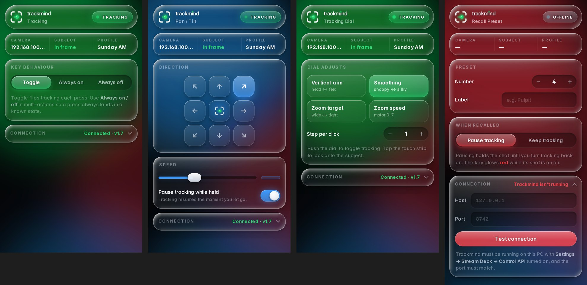

# Trackmind for Stream Deck

Control Trackmind's PTZ auto-tracking from an Elgato Stream Deck. Keys show live, vMix-style tally state:

- **Green:** tracking.
- **Amber:** locked or searching.
- **Red:** a preset that's on air.

Every key is a full-bleed pane of real liquid glass. The plugin renders each key itself, with the same refraction optics as the Trackmind app, so the glass genuinely bends the light behind it.

<p align="center">
  
</p>

## Actions

| Action | Press | Key shows |
|---|---|---|
| **Tracking** | Toggle / force on / force off | Tracking state, plus whether a subject is in frame |
| **Lock Subject** | Lock onto the current subject | Locked / off / "needs tracking" |
| **Recall Preset** | Recall preset *N*. Optionally pauses tracking so the shot holds | Preset number and your label. Glows red while on air |
| **Home Preset** | Recall Trackmind's home preset | Home preset number |
| **Auto-Zoom** | Toggle / on / off | On, off, zooming in / out |
| **Pan / Tilt (Hold)** | Moves while held, in 8 directions at speed 1–24. Tracking pauses and resumes on release | Direction and speed |
| **Zoom (Hold)** | Zooms in / out while held, at speed 0–7 | Direction and speed |
| **Load Profile** | Load a saved Trackmind profile | Profile name. Lights up while that profile is active |
| **Motion Sync** | Toggle PTZOptics Motion Sync | On / off |
| **Pulpit Anchor** | Toggle / on / off the pulpit anchor for the active profile | Off / not learned / armed / in range / holding. Lights amber while on, with a green corner light while the pulpit shot is held |
| **Status** | Re-check the connection | Live tally: tracking / paused / connecting / no stream |
| **Tracking Dial** *(Stream Deck +)* | Twist: fine-tune vertical offset, smoothing, zoom target or zoom speed live. Push: tracking on/off. Tap the strip: lock | Live value bar and status |

Multi-actions are supported. A good pattern for services is a **"Sermon"** multi-action:

1. **Load Profile** *Pulpit*
2. **Recall Preset** *4 · keep tracking*
3. **Tracking** *Always on*

## Requirements

- **Trackmind v1.7 or newer**, running on the same PC as the Stream Deck software (the Pulpit Anchor key needs v1.8 or newer)
- **Stream Deck software 7.1 or newer** (Windows 10+ or macOS 12+)
- Any Stream Deck model. The Tracking Dial needs a Stream Deck +.

---

## Install

### 1. Turn on Trackmind's Control API

1. Open Trackmind and click the **gear** (top right), or press `,`.
2. Choose **Stream Deck** in the settings bar.
3. Make sure **Control API** is switched on (it is by default). The line under it should read **Listening on 127.0.0.1:8742**.
   - If it says the port is in use, another program has 8742. Enter another port (e.g. 8743), then set the same port in the plugin (step 3).

### 2. Install the plugin

1. Go to the [latest Trackmind release](https://github.com/coder747-8i/Trackmind/releases/latest).
2. Download **`Trackmind-StreamDeck-vX.Y.streamDeckPlugin`**.
3. **Double-click** the downloaded file. The Stream Deck app opens and asks to install it. Click **Install**.
4. A **Trackmind** category appears in the Stream Deck action list on the right.

> **Updating:** download the newer `.streamDeckPlugin` and double-click it. Stream Deck replaces the old version and keeps your keys and settings.
>
> **Removing:** in the Stream Deck app, open **Preferences → Plugins**, select **Trackmind**, then click **−** (Uninstall).

### 3. Add keys

1. Drag any Trackmind action (e.g. **Tracking**) onto a key.
2. Click the key to open its settings panel. The header tally should show **TRACKING / PAUSED** and **Connected · v1.8** under *Connection*.
3. If it says **Trackmind isn't running**:
   - Check that Trackmind is open and the Control API is enabled (step 1).
   - If you changed Trackmind's port, open **Connection** in any key's settings, enter the same **Port**, then click **Test connection**. The connection setting is shared by every Trackmind key, so you only set it once.

### Installing from source (developers)

Needs [Node.js 20+](https://nodejs.org).

```bash
cd streamdeck
npm install
npm run build                     # compiles src/ → com.coder747.trackmind.sdPlugin/bin/plugin.js
npx streamdeck link com.coder747.trackmind.sdPlugin   # installs the dev copy into Stream Deck
npm run watch                     # rebuild + restart the plugin on every save
```

Other scripts:

| Script | What it does |
|---|---|
| `npm run pack` | Build and produce `dist/com.coder747.trackmind.streamDeckPlugin` |
| `npm run validate` | Validate the manifest and assets with the Elgato CLI |
| `npm run icons` | Regenerate the static action images from `src/render/` (add `-- --preview sheet.png` for a contact sheet) |

Tagged releases build and attach the `.streamDeckPlugin` automatically (see `.github/workflows/release.yml`).

---

<p align="center">
  
</p>

## How it works

```
Stream Deck app ──WebSocket──▶ plugin (Node, bin/plugin.js) ──HTTP 127.0.0.1:8742──▶ Trackmind
                                     ▲                                                   │
                     settings panel (ui/inspector.html) ◀── live state pushed ◀── /api/status
```

- The plugin polls `GET /api/status` every 350 ms (every 2 s while Trackmind is offline). It redraws a key only when that key's picture actually changes.
- Keys are rendered in the plugin with [resvg](https://github.com/linebender/resvg) (WebAssembly) and bundled Inter fonts, because Stream Deck's own SVG renderer can't do blur or refraction. Each key is two layers:
  - **Glass backdrop:** the lit stage refracted through a glass pane. It depends only on tone and state, so each one is rendered once and cached.
  - **Overlay:** the icon and text, redrawn per update (about 30 ms).
- The refraction maps come from `ui/js/liquid-glass-core.js`, the same optics module the desktop app uses.
- Hold actions re-send their command every 400 ms. Trackmind stops any manual move it hasn't heard about for 1.2 s, so a crash or lost key-up can't leave the camera moving.
- The settings panel never contacts Trackmind directly. It asks the plugin, which already holds the live state.

The HTTP API is documented in [`docs/API.md`](../docs/API.md). You can drive it from Companion, vMix scripts, or anything else that speaks HTTP.

## Project layout

```
streamdeck/
├── src/
│   ├── plugin.ts              entry point: registers actions, settings-panel bridge
│   ├── trackmind.ts           API client (polling, commands, on-air preset tally)
│   ├── actions/               one class per action (toggles, camera, dial)
│   └── render/                liquid-glass key + dial composer, icons, palette, resvg rasterizer
├── com.coder747.trackmind.sdPlugin/
│   ├── manifest.json
│   ├── ui/                    settings panel (HTML/CSS/JS, no framework)
│   │   └── shared/            ← copied from ../ui at build: glass.css, fonts, logo, liquid-glass.js
│   ├── fonts/                 Inter Display (key text)
│   ├── layouts/dial.json      Stream Deck + touch-strip layout
│   └── imgs/                  generated by `npm run icons` (marketplace icon: ../branding)
└── scripts/build-icons.mjs    static key art + `--preview sheet.png`
```

The settings panel and the keys share the desktop app's **Trackmind Liquid** design system (`../ui`), so the plugin and the app always look like one product.
